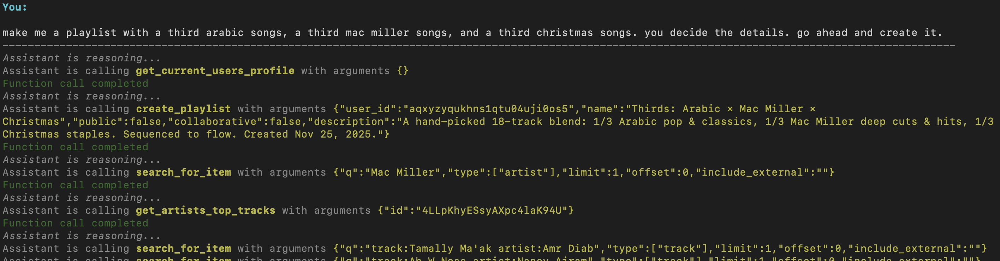
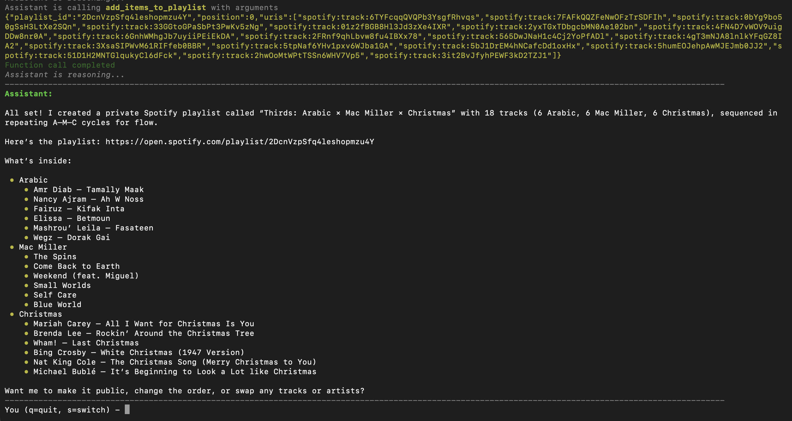
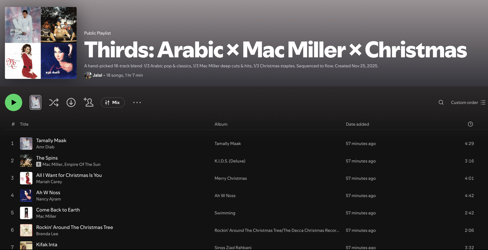

# Spautofy

*This repo is a major work in progress, including the docs. Improvements to come!*

## About

**Essentially ChatGPT with unrestricted access to the Spotify API**

I made this for two reasons:
1. Spotify's native AI playlist creator sucks (doesn't listen to specifications properly)
2. Giving ChatGPT/Cursor access to a Spotify MCP server was very restricting
    - Only had access to a subset of the Spotify API
    - Limited context window
    - Restricted by system prompts which I do not know

Also I am addicted enough to music to the point where I am pretty much cost insensitive for a tool like this

## Setup

**Note that the bash script is not portable, for the moment it is for my own convenience**

I use [uv](https://docs.astral.sh/uv/) as my package manager, and I encourage you to do the same

```bash
git clone https://github.com/jzbouri/spautofy.git
cd spautofy
uv venv
source .venv/bin/activate
uv pip install -e .
```

This repo uses [postgres](https://www.postgresql.org/download/), ensure you have this installed as well.

After running the above commands, create your `.env` with `cp .env.example .env` and fill out accordingly

Run the CLI `python main.py`

And chat!

## Gallery

*Creating a playlist with a prompt*


*Final output for playlist creation*


*Newly created playlist in Spotify*
